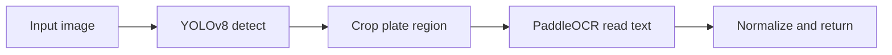

# Vietnamese License Plate Detection and OCR

End-to-end pipeline for Vietnamese vehicles: **YOLOv8** localizes license plates (car and motorcycle), then **PaddleOCR** reads text from each cropped region.

---

## Overview

| | |
|---|---|
| **Detection** | YOLOv8n (Ultralytics) |
| **OCR** | PaddleOCR (PP-OCRv5, English model) |
| **Classes** | Car plate, motorcycle plate |
| **Dataset** | [Roboflow — Vietnam License Plate](https://universe.roboflow.com/vietnam-license/vietnam-license-plate-hjswj/dataset/2) (CC BY 4.0) |

**Reference detection metrics** (10 epochs, `imgsz=416`, YOLOv8n on Roboflow split):

| Metric | Value |
|--------|-------|
| mAP50 | 0.992 |
| mAP50-95 | 0.866 |
| Precision | 0.988 |
| Recall | 0.979 |

Reproduced numbers may differ by hardware, seed, and training settings.

---

## How it works



1. `predict.py` runs YOLO on the full image and extracts bounding boxes.
2. Each crop is passed to `read_plate()` in `ocr.py`.
3. PaddleOCR detects text lines inside the crop, sorts them top-to-bottom, and normalizes output to uppercase alphanumeric characters.

---

## Project structure

```
.
├── data/
│   ├── data.yaml              # YOLO config (paths relative to this file)
│   └── ocr/                   # Optional OCR assets (images/, labels.txt)
├── model/
│   ├── best.pt                # Trained detector (for inference)
│   └── yolov8n.pt             # Base weights for training (gitignored)
├── script/
│   ├── data_reader.py         # Download dataset from Roboflow
│   ├── train.py               # Train YOLOv8 detector
│   ├── predict.py             # Detection + OCR inference
│   └── ocr.py                 # PaddleOCR wrapper for plate crops
├── samples/
│   └── test.jpg               # Example input
├── train/ valid/ test/        # YOLO images and labels (repo root)
├── requirements.txt
├── .env                       # Roboflow API key (local only)
└── README.md
```

`data/data.yaml` uses paths like `../train/images`, which resolve to `./train/` at the repository root.

---

## Requirements

- Python 3.10+ (3.13 supported with notes below)
- pip
- Roboflow API key (only for downloading the detection dataset)
- Optional: NVIDIA GPU for faster YOLO training

---

## Installation

From the repository root:

```bash
python -m venv .venv
.venv\Scripts\activate          # Windows
# source .venv/bin/activate     # Linux / macOS

pip install --upgrade pip
pip install -r requirements.txt
```

Place YOLOv8n weights at `model/yolov8n.pt` before training. Ultralytics can also download weights on first run.

For inference, copy your best detector weights to:

```text
model/best.pt
```

---

## Configuration

Create `.env` in the project root:

```env
API_KEY=your_roboflow_private_api_key
```

Do not commit `.env` or API keys.

---

## Usage

Run all commands from the **repository root**.

### 1. Download detection dataset

```bash
python script/data_reader.py
```

Ensure the YOLO layout matches `data/data.yaml` (`train/`, `valid/`, `test/` at repo root). If Roboflow downloads to a different folder name, move or symlink files and update paths in `data/data.yaml` if needed.

### 2. Train detector

```bash
python script/train.py
```

Default settings: `epochs=10`, `batch=8`, `imgsz=416`, `data=data/data.yaml`.

After training, copy the best weights:

```text
runs/detect/train/weights/best.pt  →  model/best.pt
```

(Exact run folder name may vary.)

### 3. Run detection + OCR

```bash
python script/predict.py
```

This runs `samples/test.jpg` and saves an annotated image to `samples/result_test.jpg`.

Use from your own code:

```python
from script.predict import predict

plates = predict("path/to/image.jpg", debug_ocr=True)
print(plates)
```

---

## PaddleOCR on Windows (CPU)

PaddlePaddle **3.3+** on Windows CPU can fail with:

```text
NotImplementedError: ConvertPirAttribute2RuntimeAttribute ...
```

This project disables oneDNN in `script/ocr.py`:

```python
PaddleOCR(..., enable_mkldnn=False, ...)
```

If issues persist, try:

```bash
pip install paddlepaddle==3.2.2
```

See [Paddle issue #77340](https://github.com/PaddlePaddle/Paddle/issues/77340).

---

## Limitations

- Detection quality depends on lighting, angle, blur, and occlusion.
- PaddleOCR uses an English recognition model; output is normalized to plate-like characters but does not enforce full Vietnamese plate format rules.
- OCR accuracy on cropped plates should be evaluated separately from detection mAP.
- Works best on clear, frontal or slightly angled plates.

---

## Tech stack

- [Ultralytics YOLOv8](https://github.com/ultralytics/ultralytics) — object detection
- [PaddleOCR](https://github.com/PaddlePaddle/PaddleOCR) — text recognition on crops
- [OpenCV](https://opencv.org/) — image I/O and visualization
- [Roboflow](https://roboflow.com/) — dataset download

---

## Dataset

| | |
|--|--|
| **Source** | [Vietnam License Plate (v2)](https://universe.roboflow.com/vietnam-license/vietnam-license-plate-hjswj/dataset/2) |
| **License** | CC BY 4.0 |
| **Classes** | 2 (car plate, motorcycle plate) |

---

## License

Application code is provided as-is unless a separate license file is added. When redistributing or publishing work based on this project, comply with the dataset **CC BY 4.0** terms and verify licensing for bundled assets such as fonts.
